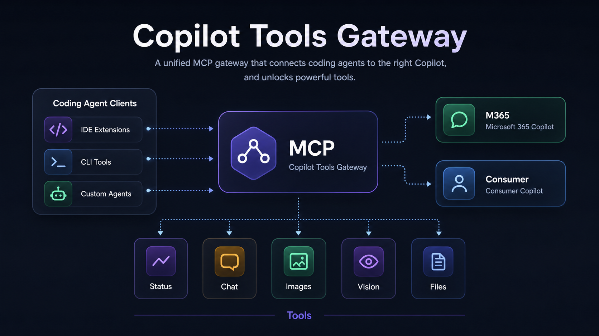

# Copilot Tools Gateway



Copilot Tools Gateway exposes Microsoft Copilot account capabilities as local
tools for agentic coding assistants. It is designed for OpenCode, Codex, Claude
Desktop, and other MCP-capable clients that already have their own primary LLM.

This project is not a selectable coding model. It provides auxiliary Copilot
tools for chat, image generation, image analysis, and file-assisted questions
when the signed-in account supports those capabilities.

> Unofficial project. This repository is not affiliated with Microsoft. It uses
> your own Microsoft account session locally. Use it responsibly and follow the
> service terms that apply to your account.

## Quickstart

Requirements:

- Python 3.11 or newer.
- Windows, macOS, or Linux.
- A Microsoft account with access to the Copilot surface you want to use.

Clone the repository and enter it:

```bash
git clone <repository-url>
cd Copilot-Tools-Gateway
```

Windows PowerShell:

```powershell
python -m venv .venv
.\.venv\Scripts\Activate.ps1
python -m pip install -e ".[dev,mcp]"
```

Unix shells:

```bash
python -m venv .venv
. .venv/bin/activate
python -m pip install -e ".[dev,mcp]"
```

If you plan to use `m365-copilot`, install the Playwright Chromium browser for
the Microsoft 365 assisted login flow:

```bash
python -m playwright install chromium
```

Create at least one provider session:

```bash
python -m copilot_tools_gateway login m365
```

or:

```bash
python -m copilot_tools_gateway login consumer
```

Run the MCP server over stdio:

```bash
python -m copilot_tools_gateway mcp
```

The installed script is also available after installation:

```bash
copilot-tools-gateway mcp
```

Use `python -m copilot_tools_gateway ...` in examples when you want the most
portable local command from the repository checkout.

## MCP Client Setup

Add this stdio server to your MCP client configuration:

```json
{
  "mcpServers": {
    "copilot-tools-gateway": {
      "command": "python",
      "args": ["-m", "copilot_tools_gateway", "mcp"]
    }
  }
}
```

If the client runs outside this repository or virtual environment, replace
`python` with the absolute path to the environment interpreter.

See [docs/mcp.md](docs/mcp.md) for the complete MCP reference, tool schemas,
response envelope, provider limitations, and agent recovery guidance.

## What It Provides

MCP tools:

- `copilot_status`
- `copilot_chat`
- `copilot_generate_image`
- `copilot_vision`
- `copilot_chat_with_files`

OpenAI-compatible HTTP compatibility surface:

- `GET /v1/models`
- `POST /v1/chat/completions`
- `POST /v1/images/generations`

Provider models:

- `copilot-auto` chooses a valid configured provider automatically.
- `m365-copilot` uses Microsoft 365 Copilot and requires an account with
  Microsoft 365 Copilot or eligible Office 365 access.
- `copilot` uses consumer Microsoft Copilot.

MCP is the primary integration surface. The HTTP API exists for simple local
compatibility.

## Choose Your Provider

Use `copilot-auto` by default. It prefers M365 when both providers are
available because M365 usually has broader file and enterprise capabilities.

Use `m365-copilot` when your account has Microsoft 365 Copilot or eligible
Office 365 access and you need document attachments, Graph-backed file access,
or M365 conversation behavior. Do not use this provider with a consumer-only
Microsoft account.

Use `copilot` when you want the consumer Microsoft Copilot account. Consumer
Copilot supports chat, image generation, and PNG or JPEG image attachments. It
tries direct WebSocket image analysis first and uses Pydoll browser-assisted
image chat as an explicit fallback for recoverable image protocol failures. It
does not support document attachments through this gateway yet.

## Login And Refresh

Login and refresh are CLI operations, not MCP tools. MCP tools return
agent-friendly recovery instructions when a provider needs login, refresh, or a
browser warm-up.

M365 login:

```bash
python -m copilot_tools_gateway login m365
```

M365 refresh:

```bash
python -m copilot_tools_gateway refresh m365
```

The M365 refresh command reuses the persistent browser profile and waits for
safe capture signals for Copilot, Graph, and search access. If document access
does not refresh silently, it asks the user to complete safe browser steps such
as sending a normal message or attaching a small document.

Consumer login:

```bash
python -m copilot_tools_gateway login consumer
```

Consumer refresh and browser warm-up:

```bash
python -m copilot_tools_gateway refresh consumer
```

Consumer login and refresh use Pydoll with a persistent Chromium profile. This
avoids the empty challenge modal behavior that can appear in Playwright-driven
consumer sessions.

Consumer Copilot may require a browser challenge before non-browser WebSocket
chat is accepted. When that happens, run `refresh consumer`, complete any
challenge in the opened browser, send one normal Copilot message, wait for the
answer, and retry the original MCP or HTTP request.

Sessions are stored under `session/`, which is ignored by Git. Do not commit or
share session files.

## Quick Smoke Checks

Check provider status through an MCP client by calling:

```text
copilot_status
```

Ask for simple chat:

```json
{
  "prompt": "Say hello in one short sentence.",
  "model": "copilot-auto"
}
```

Analyze an image with consumer Copilot:

```json
{
  "image_path": "C:\\path\\to\\image.png",
  "prompt": "Describe the image.",
  "model": "copilot"
}
```

Successful consumer image calls include safe MCP diagnostics such as
`attachment_backend`, `direct_attempted`, and `fallback_used`.

Ask about a document with M365 Copilot:

```json
{
  "file_paths": ["C:\\path\\to\\document.docx"],
  "prompt": "Summarize this document and quote its validation marker.",
  "model": "m365-copilot"
}
```

## HTTP API

Start the local API:

```bash
python -m copilot_tools_gateway api
```

The default URL is `http://127.0.0.1:3991/v1`.

List models:

```bash
curl http://127.0.0.1:3991/v1/models
```

Chat:

```bash
curl http://127.0.0.1:3991/v1/chat/completions \
  -H "Content-Type: application/json" \
  -d "{\"model\":\"copilot-auto\",\"messages\":[{\"role\":\"user\",\"content\":\"Say hello in one short sentence.\"}]}"
```

## Diagnostics

Optional diagnostics live under `tools/diagnostics/`. They are not part of
normal MCP or HTTP operation.

Consumer WebSocket health check:

```bash
python tools/diagnostics/check_consumer_websocket_health.py
```

Consumer image protocol v2 discovery:

```bash
python tools/diagnostics/check_consumer_image_protocol_v2.py
```

M365 attachment matrix check:

```bash
python tools/diagnostics/check_m365_attachment_matrix.py
```

Generate validation files without calling MCP:

```bash
python tools/diagnostics/check_m365_attachment_matrix.py --generate-only
```

Diagnostics append sanitized operational results under `captures/`. They must
not store tokens, cookies, browser storage, raw requests, raw responses, or
session file contents.

## Safety And Privacy

- Runtime sessions, cookies, and tokens stay under `session/`.
- AI-generated content is private by default.
- Public APIs return normalized gateway data, not raw vendor payloads.
- MCP diagnostics contain safe operational metadata only.
- Agents should never ask users to paste cookies, tokens, browser storage,
  session files, or raw upstream requests.

## Development

Run checks with explicit timeouts in your automation:

```bash
.\.venv\Scripts\python.exe -m pytest tests --basetemp "$env:TEMP\ctg-pytest-full"
.\.venv\Scripts\python.exe -m ruff check src tests tools/diagnostics
.\.venv\Scripts\python.exe -m mypy src
```

Use the repository virtual environment for validation. The project targets
Python 3.11 or newer, and local global Python installations may contain stubs
that do not match the configured mypy target.

The project uses small modules, explicit provider contracts, and strict typing.
See `AGENTS.md` and `code-style.md` before changing architecture.
